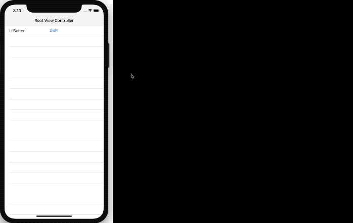
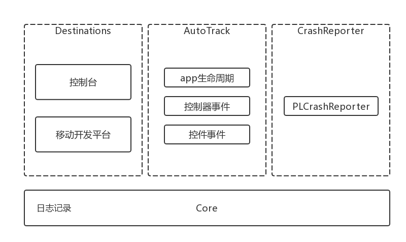
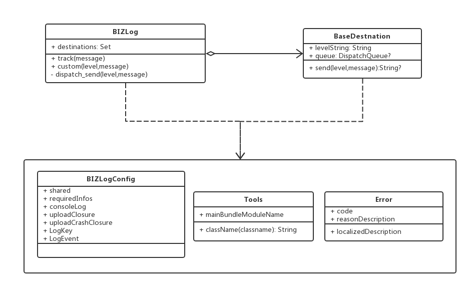
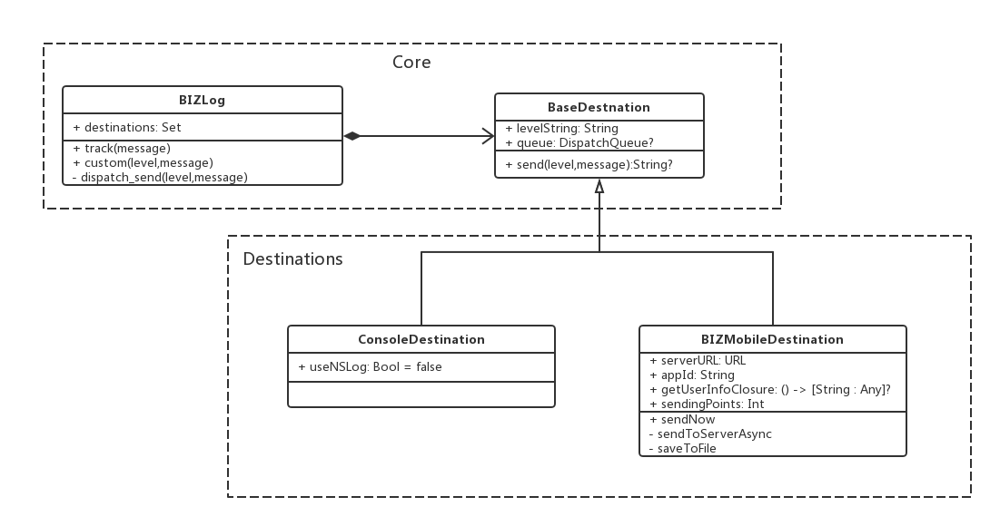
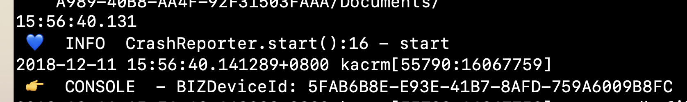
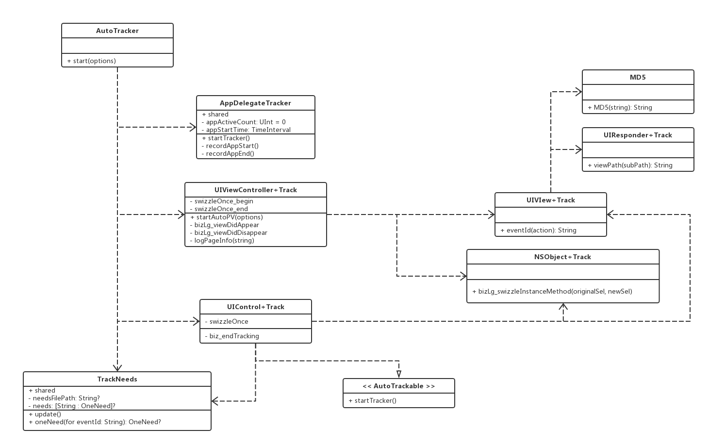
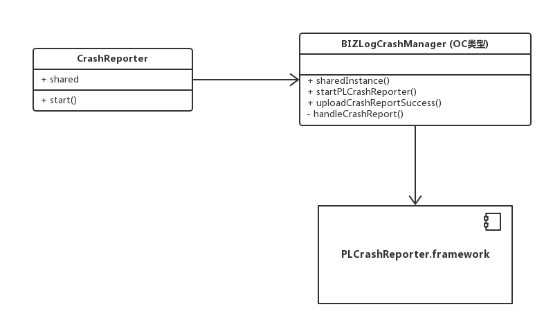

# YCILog

[](https://travis-ci.org/YanChen-ing/YCILog)
[](https://cocoapods.org/pods/YCILog)
[](https://github.com/YanChen-ing/YCILog/blob/master/README.md)
[](https://github.com/YanChen-ing/YCILog/)

日志收集

# 特性

- [x] 无埋点，可动态配置的日志收集组件。通过对少数控件基类重要交互事件的监听，筛选出需要收集的日志，并记录。

- [x] 支持分级调试日志，易统一各组件调试日志记录输出。

- [x] 支持崩溃日志收集。

- [x] 支持目标地灵活扩展。

# 演示


<!---->
# 设计

## 基本原理

通过 Objective-C 的 Runtime（运行时）特性，将日志收集方法插入有限的几个基类事件处理方法前。日志收集方法中通过控件的视图结构，生成唯一ID，以此比对配置表，收集指定日志需求。当事件触发时，在基类事件处理方法前，通过ID比对，收集指定数据，可收集控件状态，页面属性等。

## 架构图



**Core** - 核心模块。负责外部调用，日志分发到目标地。

**Destinations** - 常用的目标地。负责针对性的对数据格式化及发送。

**AutoTrack** - 自动追踪。用以支持无埋点日志追踪。

**CrashReporter** - 崩溃收集。

# 安装

```
pod "YCILog"
```

# 使用



## 准备

根据需要，继承 BaseDestnation，定义指定的目标地，当前YCILog/Destinations 已可选目标地 控制台，移动开发平台。

## Swift

1.引用

```
 import YCILog
```

2.声明一个全局变量（组件）或全局常量（主应用），用于控制模块（组件）内日志是否输出

```
// 全局常量, 控制日志输出
let logger: YCILog.Type = YCILog.self
```

```
// 组件接口类声明该变量：
public var logger: YCILog.Type?

```

3.添加日志输出目标地（继承自BaseDestination）

```
		 let c = YCIMobile.config
        
        //========= 设置 日志流 目的地 =========
        
        // 1. 移动平台
        let YCIMobile = YCIMobileDestination(appID:c.appKey, appSecret: c.appSecret, encryptionKey: "")
        
        YCIMobile.sendingPoints.track = 50
        
        let baseServer = URL(string: c.httpsServer)
        
        YCIMobile.serverURL = URL(string: "/sdk/analysis/log.do", relativeTo: baseServer)
        
        YCIMobile.getUserInfoClosure = {
            return ["userName":SGBUserInfoPersister.userInfo()?.username ?? ""]
        }
        
        YCILog.addDestination(YCIMobile)
```

4.启动其他功能

```
        //========= 启动 更多功能 =========
            
        // 启动 自动追踪
        AutoTracker.start(options: [.PV])
        
        // 启动 崩溃日志收集
        CrashReporter.shared.start()
```
5.使用处

```
	   // 根据重要程度，使用分级日志方法
       logger?.track("btn1Clicked")

       logger?.debug("abc.....")

       logger?.error("test...")
```

## Objective - C

1.新建 SGBLog.swift类对 YCILog 初始化配置。（参考swift用法）

2.引入日志宏模板 SGBLogMacro.h ,方便在OC类中，植入默认收集埋点类名，方法名，行号等调试用信息。

3.使用时，使用 SGBLogMacro.h 定义的宏方法。如：

```
    loog_Info(@"重定向 执行完成");
    
    NSDictionary *logInfo =@{loogKeyEvent:loogEventKeyStartRedirectPage,
                             loogContentKeyGroupId: @"SGBMessageViewController",
                             loogContentKeyDesc:@"消息标签页"};
    loog_Track(logInfo)

```

# Destinations - 目标地

通过继承 BaseDestination ，接受日志流数据，并针对性的处理数据，输出到对应目标地。



## 开始

```
// 实例化目标地，并进行配置
let YCIMobile = .....
....

// 添加目标地
YCILog.addDestination(YCIMobile)
```

## 已支持目标地：

### ConsoleDestination - 控制台

> * 分级日志
> * 格式日志，支持颜色，emoji❤️💙



| 属性  | 说明 | 默认值
|:-----|:-----|:-----|
| useNSLog | 使用NSLog 代替print | false |
| useTerminalColors | 使用终端中颜色 替代 Xcode 控制台❤️💙 | false |

示例：

```
        // 1. 控制台
        let console = ConsoleDestination()
        YCILog.addDestination(console)
```


# AutoTrack - 自动追踪

通过 Objective-C 的 Runtime（运行时）特性，将日志收集方法插入有限的几个基类事件处理方法前。日志收集方法中通过控件的视图结构，生成唯一ID，以此比对配置表，收集指定日志需求。当事件触发时，在基类事件处理方法前，通过ID比对，收集指定数据，可收集控件状态，页面属性等。




## 开始
```
// 启动 自动追踪
AutoTracker.start(options: [.PV])
```

## 日志需求配置

在应用中，添加 `YCITrackNeeds.json` 文件，用于设置日志配置信息。

示例：

```
{
    "Per6VfuG":{  
        "const": {
            "testABC":"oo^~^oo"
        },"kvc": {
            "currentTitle":"currentTitle"
        }
    }
    
}
```
>eventId  (事件id，调试时可通过控制台获取)
> > const （常量. 作为标签等）
> > > KEY:VALUE
> > 
> > kvc （ KVC 方式收集self属性值，keyPath 表示属性路径）
> > > KEY:KeyPath


## 支持

### AutoTracker

> start 启动 默认启动全部
> > 必 AppDelegateTracker  
> > 可选 UIViewController+Track   
> > 可选 UIControl+Track  
>

### AppDelegateTracker 

> * 应用生命周期信息收集  
进入前台 即记录 `app_start`, `activeCount`（激活次数，=1 表示首次启动）    
进入后台 即记录 `app_end`, `runtime`（一个周期运行时长 ms）
> 


### UIViewController+Track

> * 视图控制器生命周期信息收集  
`viewDidAppear` 即记录 `YCI_page_begin`  
`viewDidDisappear` 即记录 `YCI_page_end`
> 

### UIControl+Track

> * 监听 UIButton 点击事件  
> 通过混淆`UIControl.endTracking`方法，监听到 UIButton 的 touchUpInside相关事件，比对`YCITrackNeeds.json` 收集指定需求   
> 

### 扩展
参考已有收集方式，分析需要收集事件，选择合适基类方法，进行swizzle。

# CrashReporter - 崩溃收集

使用第三方开源组件 PLCrashReporter 进行日志收集。在应用启动时，检查上次是否有崩溃日志，有则通过 YCILog.error(dic) 记录，并销毁 PLCrashReporter 内的缓存。



## 开始
```
// 启动 崩溃日志收集
CrashReporter.shared.start()
```

